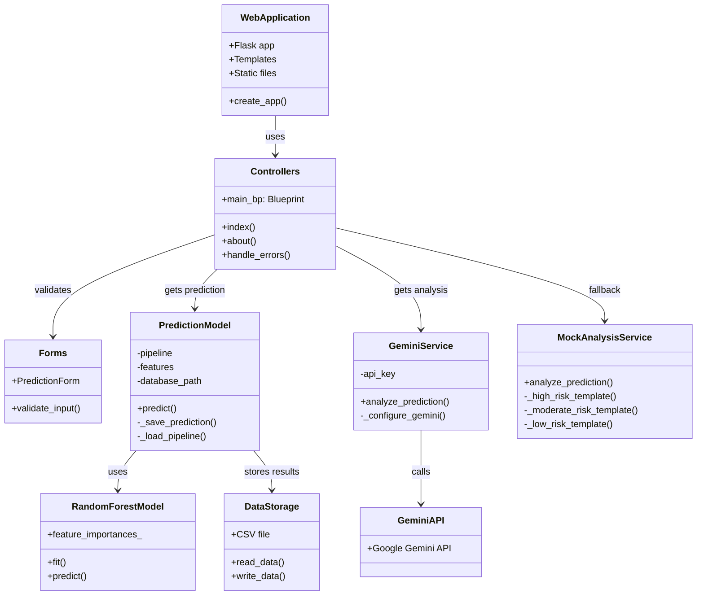
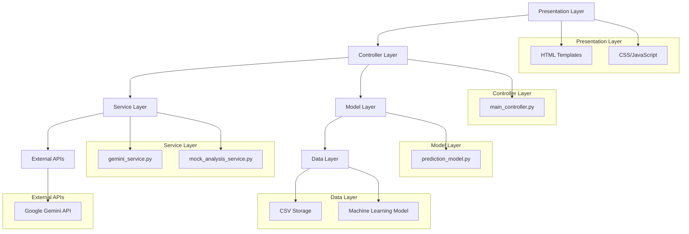
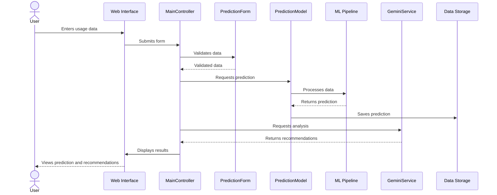

# TeenSmartInsight Component Diagrams

## System Component Diagram

This diagram shows the main components of the TeenSmartInsight system and how they relate to each other.


```

## Layered Architecture Diagram

This diagram shows the layered architecture of the TeenSmartInsight system.


```

## Prediction Sequence Diagram

This diagram shows the sequence of operations that occur when a user requests a prediction.

