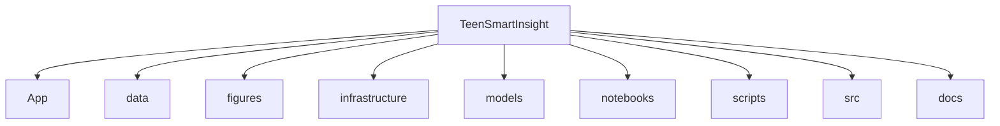
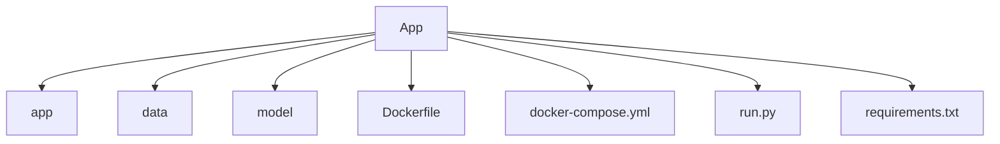
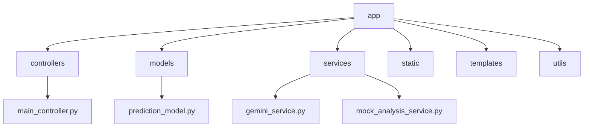
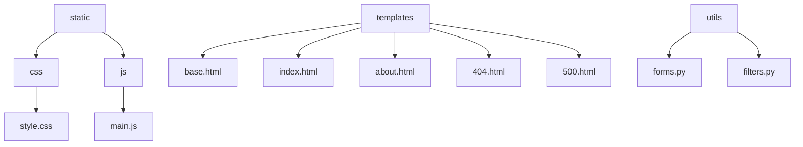
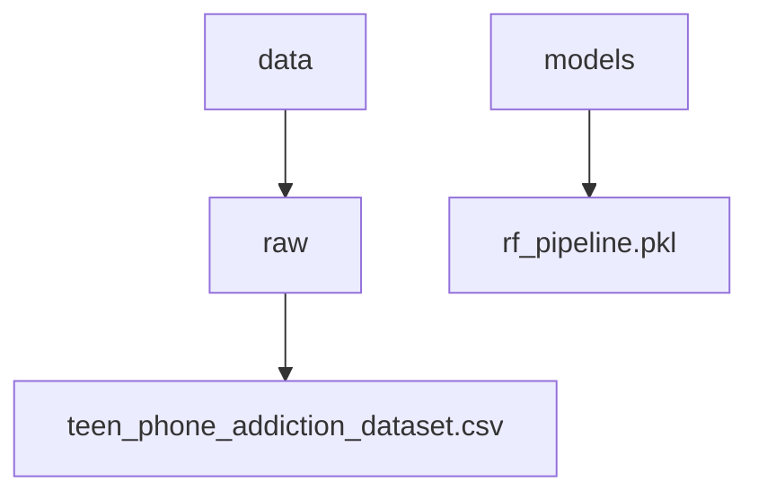
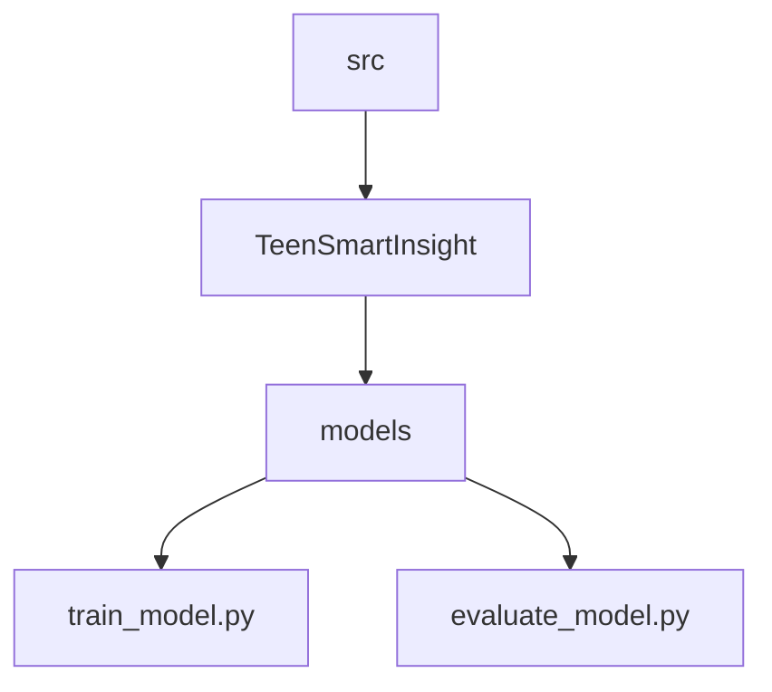
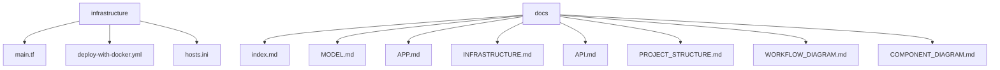

# TeenSmartInsight Project Structure

This document provides a visual representation of the TeenSmartInsight project structure using multiple diagrams for better readability.

## Main Project Structure

The following diagram shows the top-level directories of the TeenSmartInsight project:

## Web Application Structure

The following diagram shows the structure of the Flask web application:

## Application Core Structure

The following diagram shows the internal structure of the Flask application:

## Templates and Static Files

The following diagram shows the structure of templates and static files:

## Data and Model Structure

The following diagram shows the structure of data and model directories:

## Source Code Structure

The following diagram shows the structure of the source code directory:

## Infrastructure and Documentation

The following diagram shows the structure of infrastructure and documentation directories:

## Key Components Description

1. **App**: Contains the Flask web application
   - **app**: Core application code (MVC structure)
   - **data**: Stores prediction results
   - **model**: Contains the trained machine learning model

2. **data**: Contains the raw dataset used for model training

3. **figures**: Contains visualizations and demo materials

4. **infrastructure**: Contains AWS deployment configuration
   - **main.tf**: Terraform configuration
   - **deploy-with-docker.yml**: Ansible deployment playbook

5. **models**: Contains the trained machine learning model

6. **notebooks**: Contains Jupyter notebooks for data analysis

7. **scripts**: Contains utility scripts for running tests and training

8. **src**: Contains the source code for model training and evaluation

9. **docs**: Contains project documentation