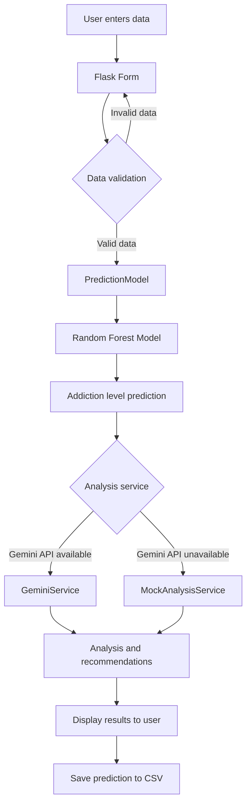
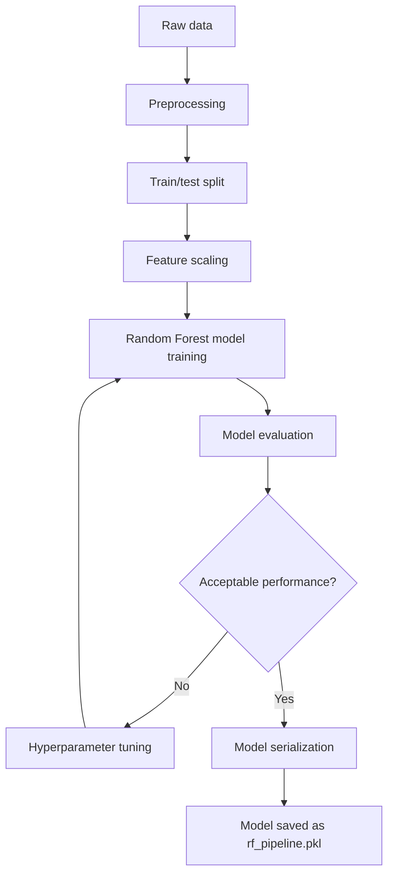
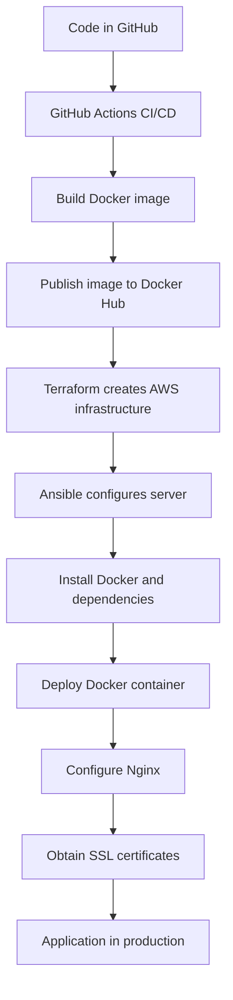
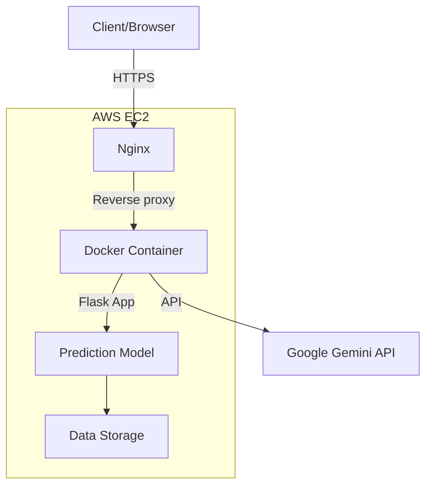

# TeenSmartInsight Workflow Diagrams

## Application Workflow

The following diagram shows the workflow of the TeenSmartInsight application, from user data input to recommendation generation.

## Model Training Workflow

This diagram shows the machine learning model training process.

## Deployment Workflow

This diagram shows the process of deploying the application to AWS.

## System Architecture

This diagram shows the general architecture of the TeenSmartInsight system.

